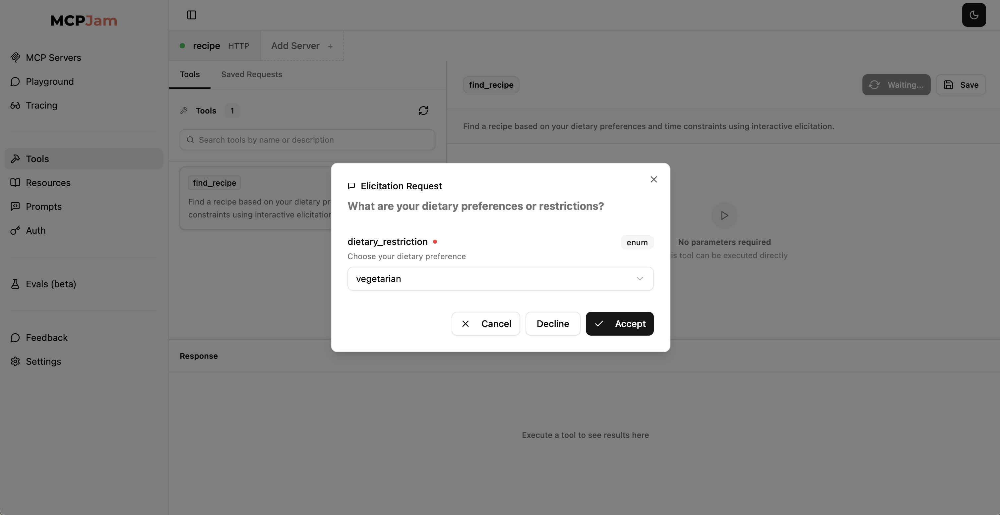

# Recipe Finder MCP Server with Elicitation

In this hackathon project, we will build an MCP server that helps users find recipes using interactive elicitation. The server will ask users about their dietary preferences and time constraints, then provide personalized recipe recommendations. The estimated time for this project is 15 minutes.

Elicitation is a powerful part of the MCP spec, enabling servers to implement powerful workflows and requesting for user input before fulfilling a request. This creates a richer MCP experience as it allows the server to obtain additional info mid-request.



## Prerequisites

- Python
- `npx` installed (to run MCPJam inspector)
- `uv` installed
- OpenAI API Token (https://platform.openai.com/api-keys)

## Step 1: Set up your environment

We need to create a new MCP server project. Set up the `uv` environment and create the necessary Python files.

macOS/Linux:

```bash
# Create a new directory for our project
uv init recipe-finder
cd recipe-finder

# Create virtual environment and activate it
uv venv
source .venv/bin/activate

# Install dependencies
uv add "mcp[cli]"

# Create our server files
touch recipe_finder.py
touch recipe_data.py
```

Windows:

```bash
# Create a new directory for our project
uv init recipe-finder
cd recipe-finder

# Create virtual environment and activate it
uv venv
.venv\Scripts\activate

# Install dependencies
uv add "mcp[cli]"

# Create our server files
new-item recipe_finder.py
new-item recipe_data.py
```

## Step 2: Implement the Recipe Data

First, let's create our recipe database. Open `recipe_data.py` and add the recipe collection:

### Step 2a: Create Recipe Data Structure

Copy over all of the contents in [recipe_data.py](recipe_data.py) and paste it into wherever your `recipe_data.py` is. We'll be importing this data in the server file.

## Step 3: Implement the Recipe Finder MCP Server

Open `recipe_finder.py` and let's build the server step by step:

### Step 3a: Import Dependencies

Import the necessary libraries for MCP server creation and elicitation:

```python
from mcp.server.fastmcp import FastMCP, Context
from mcp.server.elicitation import AcceptedElicitation, DeclinedElicitation, CancelledElicitation
from pydantic import BaseModel, Field
from recipe_data import RECIPES
import random
```

### Step 3b: Initialize the Server

Set up the FastMCP server instance:

```python
mcp = FastMCP("Recipe Finder")
```

### Step 3c: Define Elicitation Schemas

Create Pydantic models for interactive user input:

```python
class DietaryChoice(BaseModel):
    """Schema for dietary restriction selection"""
    dietary_restriction: str = Field(
        description="Choose your dietary preference",
        enum=["vegetarian", "vegan", "gluten_free", "meat", "no_restriction"]
    )

class CookingTimeChoice(BaseModel):
    """Schema for cooking time selection"""
    cooking_time: str = Field(
        description="How much time do you have for cooking?",
        enum=["quick", "moderate", "elaborate"]
    )
```

### Step 3d: Create the Recipe Finder Tool

Define the main tool that uses elicitation to gather user preferences:

```python
@mcp.tool()
async def find_recipe(ctx: Context) -> str:
    """Find a recipe based on your dietary preferences and time constraints using interactive elicitation."""

    try:
        # Step 1: Ask for dietary preferences
        dietary_result = await ctx.elicit(
            message="What are your dietary preferences or restrictions?",
            schema=DietaryChoice
        )

        match dietary_result:
            case AcceptedElicitation(data=data):
                dietary_pref = data.dietary_restriction
            case DeclinedElicitation() | CancelledElicitation():
                return "No problem! Feel free to ask again when you're ready to cook."

        # Handle "no_restriction" by randomly choosing from available categories
        if dietary_pref == "no_restriction":
            dietary_pref = random.choice(list(RECIPES.keys()))

        # Step 2: Ask for cooking time availability
        time_result = await ctx.elicit(
            message="How much time do you have for cooking?",
            schema=CookingTimeChoice
        )

        match time_result:
            case AcceptedElicitation(data=data):
                time_available = data.cooking_time
            case DeclinedElicitation() | CancelledElicitation():
                return "No problem! Feel free to ask again when you're ready to cook."

        # Step 3: Find and return matching recipe
        # ... recipe matching and formatting logic

    except Exception as e:
        return f"Oops! Something went wrong: {str(e)}"
```

### Step 3e: Add the Main Entry Point

```python
if __name__ == "__main__":
    mcp.run(transport="sse")
```

## Step 4: Test the Recipe Finder MCP Server

### 1. **Start your MCP server**

Make sure your in your venv. If not, run `.source .venv/bin/activate`. Then run the python script with `python3 recipe.py`. You should see your server spin up with SSE transport.

```
git:(main) python3 recipe.py
INFO:     Started server process [64839]
INFO:     Waiting for application startup.
INFO:     Application startup complete.
INFO:     Uvicorn running on http://127.0.0.1:8000 (Press CTRL+C to quit)
```

### 1. **Start the MCPJam inspector:**

This command will open up the MCPJam inspector with the server configured:

```bash
npx @mcpjam/inspector@latest
```

Connect to a server and paste in the URL of the server. `http://127.0.0.1:8000/sse`

### 2. Set up your OpenAI API token

Go to the MCPJam inspector's setting tab. You should see "AI Providers" settings. Paste in your OpenAI API token.

### 3. Test your server in Playground

Go to the MCPJam inspector's Playground tab. You should now be able to interact with your Recipe Finder MCP server. Try a query like "I want to find a recipe to cook" and watch as the server asks you interactive questions about your preferences!

## Step 5: Understanding Elicitation

The key feature of this project is **elicitation** - the ability for MCP servers to ask users interactive questions during tool execution. This creates a conversational experience where:

1. The user calls the `find_recipe` tool
2. The server asks about dietary preferences
3. The user responds with their choice
4. The server asks about cooking time
5. The user responds again
6. The server provides a personalized recipe recommendation

This pattern is powerful for creating interactive, user-friendly tools that gather information step-by-step.

## Step 6: Build more features (explore!)

You could extend this recipe finder by:

- Adding more dietary categories (keto, paleo, etc.)
- Including cuisine types (Italian, Mexican, Asian)
- Adding difficulty level elicitation
- Creating a meal planning tool
- Adding ingredient substitution suggestions

## MCPJam Community

We're creating MCP hackathon projects every week. If you'd like any live support, join our [Discord community](https://discord.com/invite/JEnDtz8X6z)

Please consider supporting this project and giving it a star on GitHub!
https://github.com/MCPJam/inspector

## Quick Troubleshooting

- **Server failure:** Make sure your virtual environment is activated and dependencies are installed
- **Elicitation not working:** Ensure you're using the SSE transport (`transport="sse"`) for elicitation support
- **Recipe not found:** Check that your recipe data structure matches the expected format
- **Import errors:** Make sure both `recipe_finder.py` and `recipe_data.py` are in the same directory
